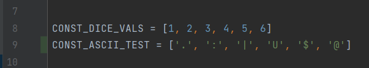
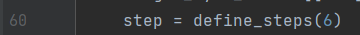
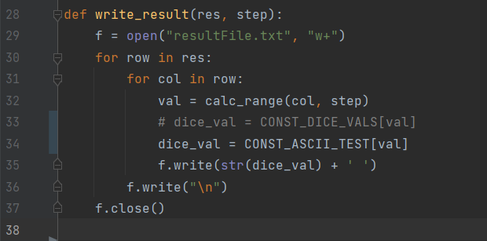
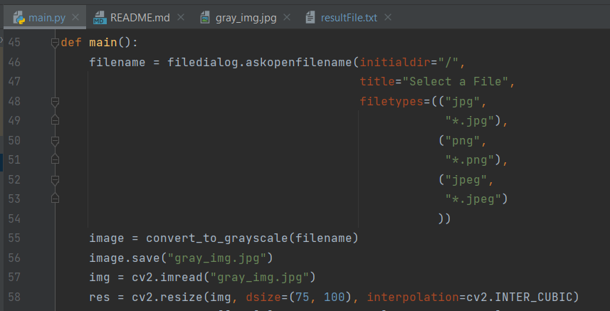

# python-filter
A program used to filter images in python, primarly used for dice art.

## How to use it

when you start the main.py file, a dialog is going to pop up. 
Click on the button to open the file explorer and choose your image.
After that, the script is going to create a file called "gray_img.jpg", 
which is then used to create a text file called "resultFile.txt".
The result file is going to contains the image filtered based on the array values that you set.
You can add any constant that you want with any elements you want, just follow the pattern use in the picture bellow.

### Important note:
If you want to add more characters, you need to change the values in the define_steps function.
The value MUST match the exact number of characters.

To change the characters displayed in the "resultFile.txt",
assign the dice_val the array that you created. In the image bellow, 
if I wanted to use the dice filter values, I could uncomment line 33 and delete
line 34.

To change the ratio. Change the dsize args values at line 58 (image bellow).
For example. The values on the image represents the number of characters on the X and on the Y axis.
75 characters gonna be displayed on the X axis and 100 gonna be displayed on the Y axis.

